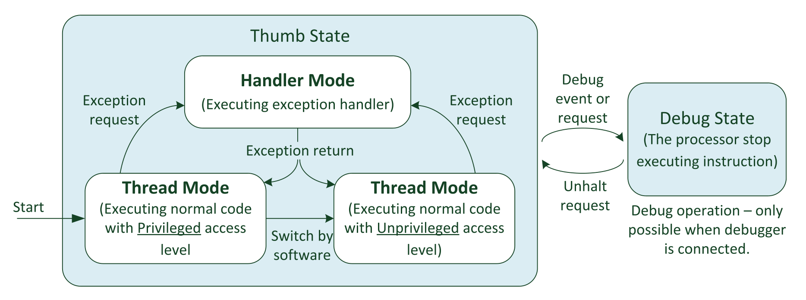

# Operation Modes and States

**Operation States**:

- Debug state: when debugging with links.
- Thumb state: when executing program codes (Thumb instructions).
- **Notes**: The system memory, including peripherals inside and outside the processor, can be accessed by the debugger in either Thumb state or debug state.

**Operation Modes**:

- Handler Mode: when executing an exception handler (such as an Interrupt Service Routine, ISR).
- Thread Mode: when executing normal application code.

**Privileged and unprivileged access levels**:

- Privileged access level: which can access all resources in the processor
- Unprivileged access level: some memory regions are inaccessible, and a few operations cannot be used.
- **Notes**: switch from Privileged to Unprivileged is allowed in Thread Mode, however, back is not permitted. If this is need, the processor has to use the exception mechanism (Handler Mode) to handle the switch.
- **Notes**: almost all of the NVIC registers are privileged access only.
- For example: a system can contain an embedded OS kernel that executes in privileged access level, and application tasks which execute in unprivileged access level. In this way, we can set up memory access permissions using the Memory Protection Unit (MPU) to prevent and application task from corrupting memory and peripherals used by the OS kernel and other task. If an application task crashes, the remaining application tasks and the OS kernel can still continue to run.

> [!WARNING]
>
> By default, the Cortex-M processors start in privileged Thread Mode and in Thumb state. Unprivileged Thread model is not available in the Cortex-M0 processor, but is optional in the Cortex-M0+ processor.